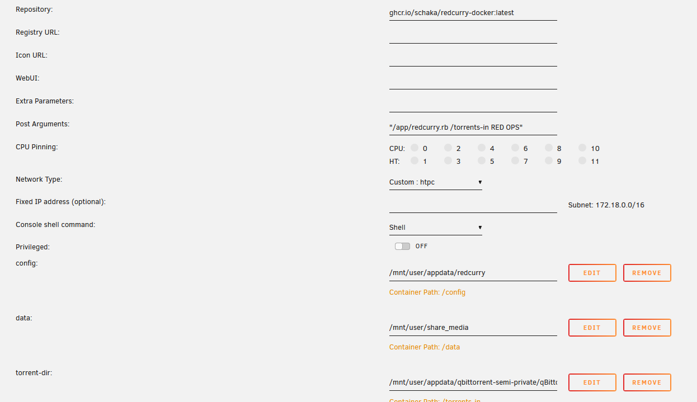

# Docker image for redcurry
All I do is provide an Alpine based docker image.
The actual software does not change and you still have to supply the CLI commands yourself.

This can be done via docker-compose, Unraid or a simple Linux CLI command.

### Simple start
```sh
docker run ghcr.io/schaka/redcurry-dockerlatest "/app/redcurry.rb /path/to/folder/with/.torrent/files SOURCE TARGET"
```

### Config file
`$HOME` is mapped to `/config`. You can just place the `curry.yaml` file into whatever folder you choose to map to `/config` inside the container.
The docs are [here](https://github.com/DevYukine/red_oxide?tab=readme-ov-file#config-file).

For Unraid:
- Extra Parameters: `--user 99:100`
- Post Arguments: `"/app/redcurry.rb /path/to/folder/with/.torrent/files SOURCE TARGET"` (yes, with double quotes)
- Or Post Arguments: `"/app/redcurry.rb 'https://url-to-torrent-permalink' SOURCE TARGET"` (yes, with double quotes)

